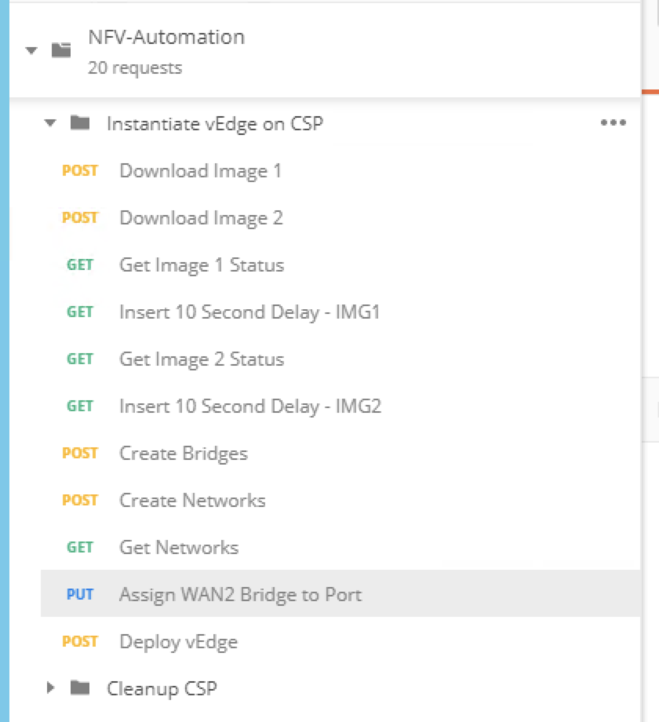
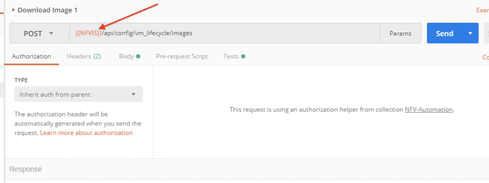
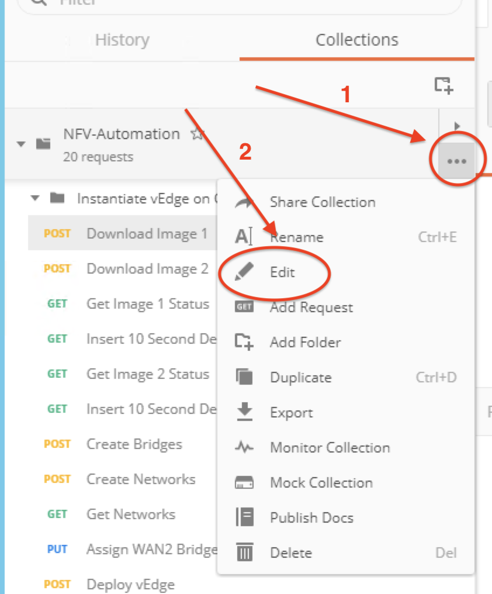

## NFV-Automation

### Exploring the First API Call

Inside the imported collection are two folders.  Expand the first one called **Instantiate vEdge on CSP**.

This collection contains a set of API calls that will be used to complete the processes necessary to instantiate a vEdge.  This is an example of how to do a VNF deployment.  The API calls can be modified for any VM.  



Note that we are using different types of REST calls here in order to accomplish the overall project.  Let's explore the first API call ***Download Image 1***.

Click on that API call and examine its details in the main Postman window.

The landing page for the API call shows that we are utiling a **POST** REST action with the API listed after that.  



We are using a variable for NFVIS here.  If you are unfamiliar with Postman, variables are identified by a **{{XXX}}** format.  That variable can be populated from either the Environment Variables set of variables or potentially from an imported file during a collection run (more on this later).  

Also note on this screen that the Authorization for security accessing our NFVIS is set to "Inherit auth from parent".  This parent setting is part of the Collection settings.  Since this hasn't been set for your environment yet, we need to modify the username and password for accessing your NFVIS at this time.

Start by clicking on the ellipsis to the right of the collection's name.  Then select "Edit" to access the settings for the collection.



On the settings screen, move over the the Authorization tab and then modify the username and password to match your NFVIS' settings.  Finally, click on Update to commit these changes. With this completed, our API calls will now inherit this setting for authorizing all calls to NFVIS.

Let's move back to exploring the settings for our first API call.  The next tab under the API call is **Headers**.  In this tab we are just setting the formats for how extra content will be sent to NFVIS, and how it will be received.  We are using the Environment Variables to set these.  Don't change either of these.

The third tab over is **Body**.  Here is where we provide additional information for the API call in order for it to work successfully.  

The REST API call is:

```
POST https://NFVIS-IP/api/config/vm_lifecycle/images
``` 

But this isn't enough information to provide all the details the API call needs.  As you can see, we are providing those neceessary additional details about where NFVIS can download the image in the body field.  


In JSON format, we are providing the name of the image we want to import and the source of that image.  This is all done through variables so that it's easy to modify.  Notice that we have provided the FTP-Server variable in the Environment Variables section, but we have not provided the IMAGE1 variable yet.  That will come later.

On the main Postman screen, we can choose to execute an API call by clicking on the blue **Send** button to the right of the API.  But this will only permit us to run one API.  In order to complete all the steps for instantiating our vEdge, we need to run command successively.  Postman allows us to do this through a tool called Collection Runner.

### [Next Step - Investigating Collection Runner](Module3.md)